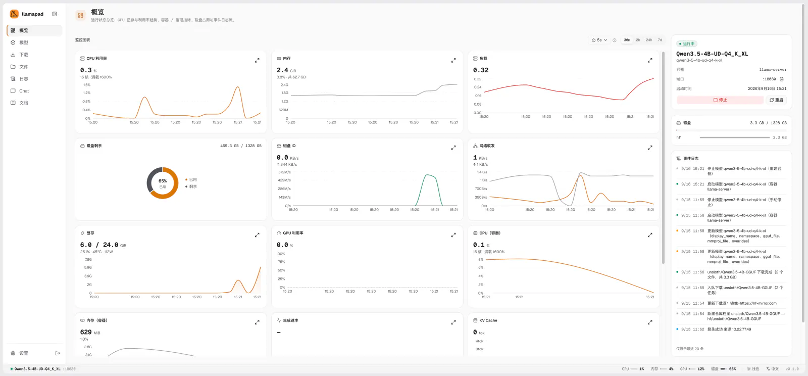
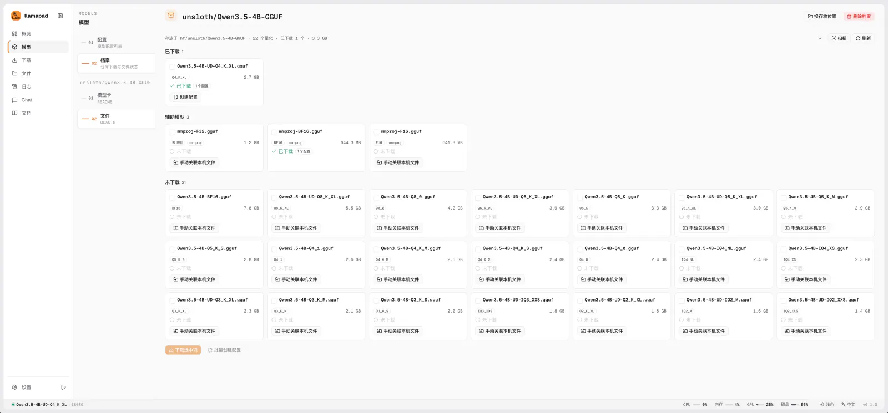

# llamapad

[](./LICENSE)
[](https://hub.docker.com/r/lancelrq/llamapad)
[](https://hub.docker.com/r/lancelrq/llamapad)
[](https://github.com/LanceLRQ/llamapad/actions/workflows/docker-publish.yml)
[](https://github.com/ggml-org/llama.cpp)

**中文** | [English](README.md)

`llamapad` 是一个自托管的 llama.cpp 模型管理面板，在浏览器里管理 Docker 化的 llama.cpp 服务与模型文件，部署本地大模型。

> [!NOTE]
> 当前为预览版本，正式版之前功能与配置格式仍可能调整。使用中遇到 Bug 或有功能建议，欢迎[提交 Issue](https://github.com/LanceLRQ/llamapad/issues)，感谢试用！

<p align="center">
  
  
</p>

## 特性

- 🎛️ **模型管理**：模型列表、一键启动/停止（Docker + GPU 加速）；可同时运行多个模型，端口冲突自动顺延，API 中转按 `model` 字段路由
- ⚡ **MTP 加速**：按 GGUF 元数据识别权重是否带 MTP 层，一个开关开启投机解码，也可以关联单独的加速权重
- 🏠 **模型首页**：正在运行的模型、最近更新的仓库，以及 HuggingFace 上热门与搜索到的 GGUF 仓库，一键进下载
- 📝 **参数配置**：面板内表单编辑，直接展示合并后的最终参数；配置支持 YAML 导入/导出与自动快照，可以进 git 做备份
- 🗂️ **命名空间**：自定义空间分组、跨空间共享 GGUF 文件、按引用安全删除
- 📥 **模型下载**：HuggingFace（官方与镜像站）和 URL 直链，断点续传、sha256 校验，代理在面板里配；输入仓库地址会自动按量化（Q4/Q8/…）分组，分片模型自动成组
- 🧙 **新建向导**：从选仓库、挑文件到保存配置，一步走完
- 📁 **文件管理**：ComfyUI 式的统一目录浏览、移动/重命名带引用检查、磁盘占用一览
- 📊 **监控**：容器 CPU/内存、llama.cpp 推理指标（slots、token 速率）、GPU 显存与温度、宿主机磁盘与网络、实时日志
- 💬 **Playground**：面板自带的对话页；`/llama-proxy/*` 还提供推理接口反代，SSH 隧道场景只需要暴露面板一个端口
- 🔐 **鉴权与 API**：登录保护，REST API 可直接脚本调用
- 🌏 **双语界面**：中/英切换，面板内置文档中心

## 快速部署

一行命令安装（需要 Linux + Docker；GPU 加速需 NVIDIA Container Toolkit）：

```bash
curl -fsSL https://raw.githubusercontent.com/LanceLRQ/llamapad/main/deploy/llamapad.sh | bash
```

脚本会检查 Docker 环境，默认装到 `/opt/llamapad`，然后引导你选择模型库位置（列出各磁盘剩余空间）、运行身份、GPU、端口与管理员密码（留空随机生成），自动探测 `docker.sock` 的 gid，最后拉取镜像启动。

装好后在任意目录执行 `llamapad` 进入管理菜单：

| 命令 | 作用 |
|---|---|
| `llamapad` | 方向键菜单 |
| `llamapad start` / `stop` / `restart` / `status` | 启停与状态 |
| `llamapad logs -f` | 跟随日志 |
| `llamapad config` | 改端口、监听地址、模型库、GPU、管理员密码等 |
| `llamapad build [--repo 路径]` | 本地构建镜像（找到仓库时菜单里也会出现「构建镜像」） |
| `llamapad upgrade` | 升级脚本与镜像 |
| `llamapad doctor` | 环境自检 |
| `llamapad uninstall` | 卸载 |

不想用脚本也可以手工部署 compose，见[部署与运维](./docs/guide/zh/deployment.md)。已有手工部署的目录直接运行脚本即可接管（先备份，数据与模型不动）。

## 文档

完整文档在 [`docs/guide/`](./docs/guide/zh/)（中英双语），面板内也可直接阅读（侧栏「文档」）。文档之间没有固定阅读顺序，按需查阅即可。

**入门**

| 篇目 | 内容 |
|---|---|
| [快速开始](./docs/guide/zh/quickstart.md) | 部署三步、首次登录、启动第一个模型 |
| [术语表](./docs/guide/zh/glossary.md) | GGUF、量化、分片、命名空间等名词速查 |

**部署**

| 篇目 | 内容 |
|---|---|
| [部署与运维](./docs/guide/zh/deployment.md) | 目录布局、运行身份与权限、构建代理、升级与备份 |
| [HTTPS 反代](./docs/guide/zh/nginx.md) | nginx 参考配置，单域名与子域名两种拓扑 |

**使用**

| 篇目 | 内容 |
|---|---|
| [模型管理](./docs/guide/zh/models.md) | 新建/编辑/克隆、参数分组、多模型运行、就绪判定 |
| [模型下载](./docs/guide/zh/downloads.md) | HF 与直链、断点续传、校验、代理配置 |
| [文件与命名空间](./docs/guide/zh/files.md) | 目录结构、命名空间语义、引用检查、删除三层语义 |
| [设置项详解](./docs/guide/zh/settings.md) | 四组设置逐项说明 |

**运维与排错**

| 篇目 | 内容 |
|---|---|
| [监控与日志](./docs/guide/zh/monitoring.md) | 指标口径、多卡聚合规则、三层保留与降源 |
| [配置格式与迁移](./docs/guide/zh/config.md) | 导出 YAML 的字段说明、手工编辑、从 llama-launcher 迁移 |
| [排错](./docs/guide/zh/troubleshooting.md) | 已知坑清单，均有真机案例 |

**接口**

| 篇目 | 内容 |
|---|---|
| [推理接口](./docs/guide/zh/inference.md) | Playground、中转接口、客户端与 SDK 接入 |
| [面板 API](./docs/guide/zh/api.md) | 鉴权、常用任务示例、完整端点清单 |

English documentation: [`docs/guide/en/`](./docs/guide/en/).

各版本的变更见[更新日志](./CHANGELOG_zh.md)。

## 开发

```bash
pnpm install       # 包管理器是 pnpm
pnpm run dev       # 开发（PANEL_DOCKER 默认 mock，无需真实 docker.sock）
pnpm test          # 测试（vitest）
pnpm run lint      # eslint
pnpm run build     # 构建（next build，standalone 产物）
```

## 贡献

欢迎提交 Issue；PR 前建议先开 Issue 讨论。报 Bug 时建议附上 `llamapad doctor` 的输出。

## License

MIT，详见 [LICENSE](./LICENSE)。

---

如果 llamapad 帮到了你，欢迎在 [GitHub](https://github.com/LanceLRQ/llamapad) 和 [Docker Hub](https://hub.docker.com/r/lancelrq/llamapad) 上点个 Star。
